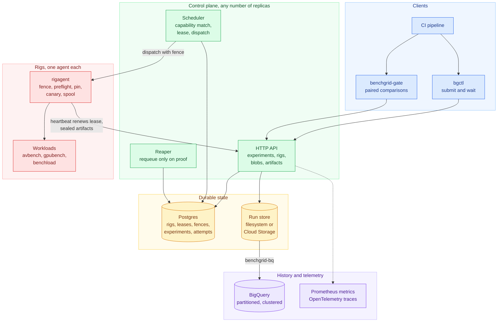
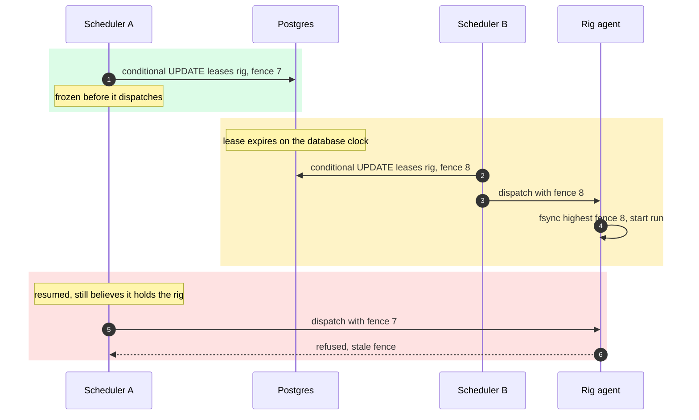
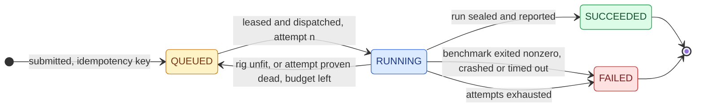
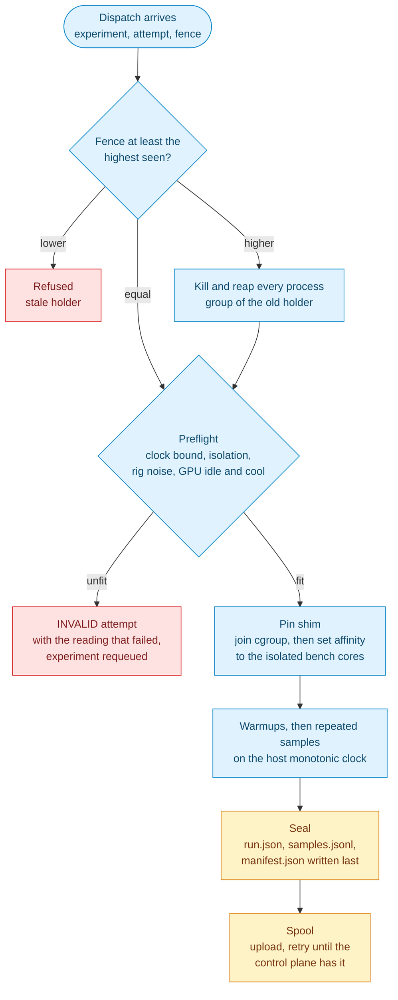
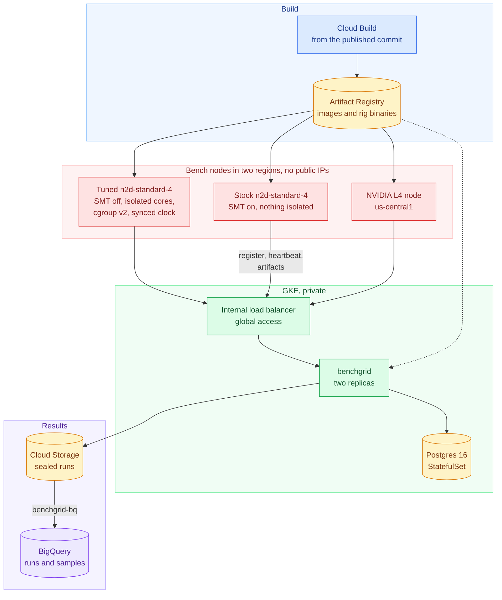
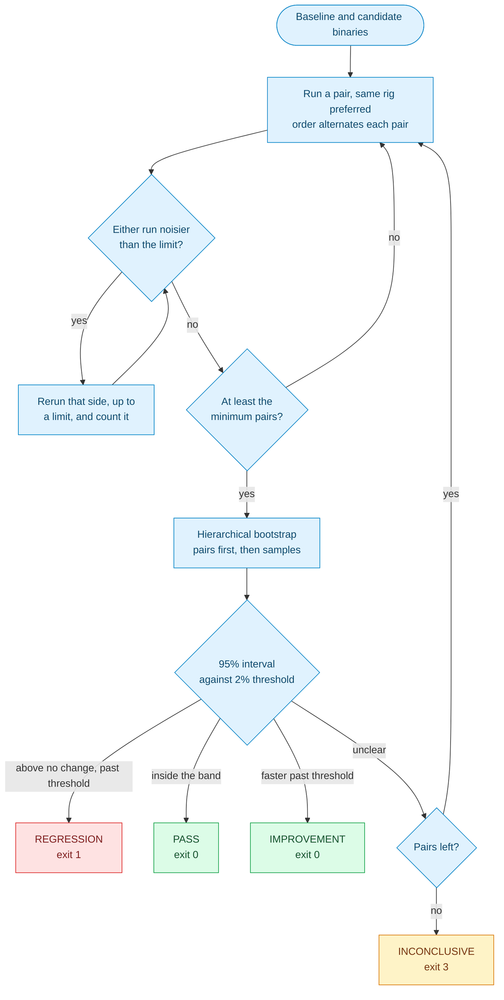

# benchgrid

[](https://github.com/rajeev-chaurasia/benchgrid/actions/workflows/ci.yml)

A control plane for running performance experiments on scarce, exclusive
hardware. It matches each experiment to a rig that satisfies it, leases the
rig exclusively, checks the rig is fit to measure on, runs warmups and
repeated samples, and publishes every raw sample with the provenance needed
to trust it. A CI gate on top tells a real regression from a noisy machine.
Go and Postgres for the control plane, one agent process per rig, C++ and
PyTorch workloads, and Python for the gate and the studies.

It is built so its central claim can be checked rather than taken on trust:

> Under concurrent schedulers racing for a fixed pool of rigs, including
> schedulers that are frozen past their lease and then resumed, no rig ever
> executes work for two lease holders at overlapping times, and the same
> harness produces overlapping execution when the fencing check is removed.

The first results come from one Apple M4 laptop, where every rig is a process
or a Linux container; rigs that advertise hardware they do not have are marked
`emulated` in every result they produce, and a spec must opt in before it can
be placed on one. The rest come from a fleet of cloud VMs in GCP and a real
NVIDIA L4, none of them emulated. No physical bench rig took part in either.

## Contents

- [Results at a glance](#results-at-a-glance)
- [Architecture](#architecture)
- [How the guarantee works](#how-the-guarantee-works)
- [Inside a rig](#inside-a-rig)
- [The measured result](#the-measured-result)
- [On real machines: a GCP fleet](#on-real-machines-a-gcp-fleet)
- [The CI gate](#the-ci-gate)
- [What a run produces](#what-a-run-produces)
- [Running it](#running-it)
- [Layout](#layout)

## Results at a glance

Every number on this page is rendered from the published evidence by
`go run ./script/readme_numbers`, and CI fails if the page says anything the
evidence does not. Each row links to its full section, method and caveats
included.

<!-- evidence:glance -->
| study | with benchgrid | without, or the control | where |
| --- | --- | --- | --- |
| [lease race](#the-lease), double bookings | **0** | 40,262 with a read then write | laptop |
| [frozen schedulers](#the-fence), overlapping runs on one rig | **0** | 96 with the fence check removed | laptop, Linux containers |
| [chaos](#chaos), experiments ending as they should | **600 of 600** | n/a | laptop |
| [CI gate, first evaluation](#the-gate-on-every-avbench-profile), pairs mostly split across rigs | 8 of 180 false, 55 of 60 caught | n/a | GCP |
| [CI gate, pairs on one rig](#pairing-on-one-rig-and-leaving-noisy-rigs-out), noisy rigs excluded | **0 of 90** false, **60 of 60** caught | 59 reruns for noise without the rig noise limit, 1 with | GCP |
| [GPU gate](#the-gpu) | null **PASS +0.1%**, depth 2 to 3 **REGRESSION +34.8%** | n/a | NVIDIA L4 |
| [tuned against stock nodes](#against-a-stock-machine), median CV under noise | **0.9%** | 1.6% on stock nodes | GCP |
| [50 Hz sensor loop](#a-sensor-in-the-loop-simulated), deadline misses | **0 of 36,000** | 5 of 36,000 on stock nodes | GCP |
| [rig noise canary](#noisy-rigs-benched), jobs placed on a noisy rig | **0** | 19 with no limit | GCP |
| [scale](#scale), jobs succeeded | **12,000 of 12,000** at 200 jobs/minute | n/a | GCP |
<!-- /evidence:glance -->

## Architecture



Colours mean the same thing in every diagram here: blue for clients, green for
the control plane, amber for durable state, red for the rig, violet for
history.

The control plane is stateless apart from Postgres, so replicas can be killed,
frozen or restarted at will; the chaos run does all three. The rig agent is
the only process that runs a benchmark, and it trusts nothing it is sent
without checking the fence first.

## How the guarantee works

Two mechanisms, and the second is the one most designs leave out.

**A lease granted in one statement.** A rig's row holds `holder`,
`expires_at`, and a `fence` that only ever increases. Acquisition is a single
`UPDATE ... WHERE holder IS NULL OR expires_at < clock_timestamp()` that also
increments the fence, so there is no window between seeing a rig free and
taking it, and expiry is judged on the database clock rather than any
scheduler's. The experiment claim and its attempt counter change in the same
transaction.

**A fence enforced at the rig.** A lease cannot stop a scheduler that was
frozen past its TTL from waking up and dispatching anyway, because the
scheduler does not know it was frozen. So every dispatch carries the fence,
and the agent keeps the highest one it has seen, fsynced before use. A lower
fence is refused. A higher one first kills and reaps everything running under
the old one, then proceeds. This is the fencing token pattern; without it the
lease is advice.



Leases are renewed by the rig's own heartbeat, conditioned on the fence, so a
scheduler crash loses nothing, and a lease that lapsed during a control plane
outage resumes if nobody took it over. The reaper requeues an attempt only
once the rig has shown it is not running it.



The reasons behind each of these are in [docs/adr](docs/adr).

## Inside a rig



Every benchmark runs in its own process group, recorded on disk with its
start time before it is launched, so an agent that dies and restarts can find
and reap anything it left running instead of letting it share the rig with
the next holder. While the rig is idle the agent runs a fixed calibration
canary on its bench cores and reports the spread; a spec can refuse rigs
noisier than a limit, or not yet measured.

## The measured result

<!-- evidence:source -->
From `evidence/results/20261007T175228Z/`, at commit `1e07558`, on Postgres 14.18 (Homebrew) and an
Apple M4 whose own background load kept 25% of its CPU busy before any run started.
<!-- /evidence:source -->
Every number below is rendered from those files by
`go run ./script/readme_numbers`, and recomputed from the raw data by
`go run ./script/validate_evidence`. CI runs both on every push: the first
fails if this README quotes a number the evidence does not say, the second if
any summary disagrees with its raw data or either negative control ever stops
failing.

### The lease

<!-- evidence:lease -->
64 workers, 20 rigs, 50,000 acquisition attempts per mode, TTLs of 5 to 20 ms,
one grant in ten left to expire.

| acquire | grants | double bookings | peak attempts in flight |
| --- | ---: | ---: | ---: |
| one conditional `UPDATE` (the product) | 2,193 | **0** | 63 |
| read, then unconditional write (control) | 5,894 | 40,262 | 64 |
<!-- /evidence:lease -->

### The fence

Three control plane replicas. Replicas freeze themselves with `SIGSTOP`
between leasing a rig and dispatching to it, and are resumed after the lease
has lapsed and the rig has been leased again by someone else. The run is done
twice: with every agent a process on the host, and with every agent a Linux
container in Docker's Linux VM on the same laptop. In the Linux run, rigs are
also cut off from the network for longer than their lease while they keep
running, which a host process cannot be.

<!-- evidence:fence -->
| rigs | agent | experiments | freezes | partitions | stale dispatches that reached a rig | refused | overlapping process pairs | overlapping session pairs |
| --- | --- | ---: | ---: | ---: | ---: | ---: | ---: | ---: |
| 8 host processes | checks the fence | 300 | 38 | n/a | 51 | 51 | **0** | **0** |
| 8 host processes | does not (control) | 300 | 32 | n/a | 35 | 0 | 38 | 45 |
| 6 Linux containers | checks the fence | 300 | 44 | 15 | 43 | 43 | **0** | **0** |
| 6 Linux containers | does not (control) | 300 | 31 | 14 | 27 | 0 | 58 | 40 |
<!-- /evidence:fence -->

The last two columns are the point. The same harness, the same freezes,
against an agent that trusts whatever it is sent, runs two holders' work on one
rig at once. Overlap is computed from every benchmark process and every
session each agent recorded, on the host's monotonic clock, including the
lifetime of any benchmark an agent's death left running.

### Chaos

<!-- evidence:chaos -->
3 replicas, 8 rigs in four emulated hardware classes, 600 experiments,
48 of them built to fail. During the run: 52 agents killed and restarted, 14
replicas killed and restarted, 28 replicas frozen, 8 outages of the whole
control plane at once, and one artifact write in five refused. Those random
faults, with nothing aimed, produced 4 stale dispatches, every one refused
at the rig.

| | |
| --- | ---: |
| experiments ending as they should (sound ones succeed, broken ones fail) | 600 of 600 |
| final attempts with a sealed artifact that verifies and agrees with the control plane | 600 of 600 |
| runs placed on a rig their spec did not allow | 0 |
| overlapping process pairs | 0 |
| rigs still leased afterwards | 0 |
| experiments needing more than one attempt | 50 with 2, 6 with 3, 1 with 4 |
<!-- /evidence:chaos -->

### A second, weaker claim

<!-- evidence:noise_claim -->
> With bursty load injected on its host, the measurement gate declined to
> publish 12 of 12 runs that an ungated agent published with a median
> coefficient of variation of 49.5%, against 38.5% with no injected load.
<!-- /evidence:noise_claim -->

It is weaker on purpose, and here is how.
<!-- evidence:noise -->
No loaded run got through the gate. The gate also declined 12 of
12 runs with no injected load, because the host's own background load,
25% of its CPU before the runs began, crossed the limit during them. A
gate that refuses that often on an idle machine is not one anybody would
leave switched on here.

| condition | published | declined | median CV of published | median latency |
| --- | ---: | ---: | ---: | ---: |
| no load | 12 | 0 | 38.5% | 99.9 ms |
| no load, gated | 0 | 12 | n/a | n/a |
| bursty load | 12 | 0 | 49.5% | 87.0 ms |
| bursty load, gated | 0 | 12 | n/a | n/a |
<!-- /evidence:noise -->

On this machine the gate is coarse and conservative, and its numbers are
about this machine. The first two designs of the gate failed outright, one by
making the noise worse, and [PLAN.md](PLAN.md) records both.

## On real machines: a GCP fleet

Everything above runs on one laptop. This section is a fleet in GCP built by
`deploy/gcp`: the control plane on GKE with its run store in Cloud Storage,
bench nodes provisioned by a startup script with kernel isolation, a GCE
synchronised clock and the agent under systemd, a real NVIDIA GPU node, and
every binary built from the published commit by Cloud Build. Each study
publishes every run it caused, and `benchgrid-study validate` recomputes its
numbers from them in CI.



<!-- evidence:gcp_source -->
- `evidence/results/20261008T020541Z-gcp/`, published at commit `a76802c`: 3 tuned and 1 default bench nodes (n2d-standard-4, one thread per core, AMD EPYC 7B13,
  kernel 6.1.0-53-cloud-amd64), control plane on GKE 1.35.8-gke.1225000, two replicas, Postgres 16 in cluster.
- `evidence/results/20261008T053316Z-gcp/`, published at commit `c2abb86`: 4 tuned and 4 stock bench nodes (n2d-standard-4, AMD EPYC 7B13,
  kernel 6.1.0-53-cloud-amd64), control plane on GKE 1.35.8-gke.1225000, two replicas, Postgres 16 in cluster.
<!-- /evidence:gcp_source -->

### The gate on every avbench profile

`avbench` is a C++ suite of 30 deterministic kernels shaped like an autonomy
stack (planning, clustering, filtering, ray casting, point cloud registration)
with a `--slowdown` flag that injects a known regression. The gate is
described [below](#the-ci-gate).

<!-- evidence:gcp_gate -->
240 comparisons over the 30 avbench profiles on tuned nodes: 180 null, where
baseline and candidate are the same binary, and 60 with an injected slowdown.
1,986 runs, 80 of them reruns of a run noisier than 5%; 396 of 993 pairs ran on
one rig.

| comparison | comparisons | REGRESSION | PASS | INCONCLUSIVE | other |
| --- | ---: | ---: | ---: | ---: | ---: |
| null (no change) | 180 | 8 | 145 | 26 | 1 |
| injected 3% | 15 | 12 | 1 | 2 | 0 |
| injected 5% | 15 | 13 | 0 | 1 | 1 |
| injected 8% | 15 | 15 | 0 | 0 | 0 |
| injected 12% | 15 | 15 | 0 | 0 | 0 |

On the null comparisons, 8 of 180 were called a regression: a false alarm rate
of 4.4%. Of the injected ones, 55 of 60 were caught.
<!-- /evidence:gcp_gate -->

### Pairing on one rig, and leaving noisy rigs out

The evaluation above had most of its pairs split across two machines. Two
more evaluations ran at the same time on the same tuned nodes, one as before
and one with pairs required to share a rig and rigs with a noisy canary
excluded:

<!-- evidence:gcp_gate_ab -->
| | soft affinity, no noise limit | strict pairs, noisy rigs excluded |
| --- | ---: | ---: |
| comparisons | 150 | 150 |
| pairs on one rig | 500 of 500 | 454 of 454 |
| false alarms on null comparisons | 0 of 90 (0.0%) | 0 of 90 (0.0%) |
| null comparisons inconclusive | 4 of 90 | 0 of 90 |
| injected regressions caught | 60 of 60 | 60 of 60 |
| caught at 3% | 15 of 15 | 15 of 15 |
| caught at 5% | 15 of 15 | 15 of 15 |
| caught at 8% | 15 of 15 | 15 of 15 |
| caught at 12% | 15 of 15 | 15 of 15 |
| runs, and reruns for noise | 1,000, 59 | 908, 1 |
<!-- /evidence:gcp_gate_ab -->

With more nodes and less contention, the soft pairs landed on one rig every
time too, so this did not isolate strict pairing; both runs had what the
first evaluation lacked, and neither raised a false alarm. What did differ is
the noise limit: keeping noisy rigs out removed almost every rerun for noise
and every inconclusive verdict.

### The GPU

<!-- evidence:gcp_gpu -->
On a real NVIDIA L4, 23034 MiB, driver 580.178.04, not emulated. Before each run the agent read the GPU's
temperature at 47 C to 52 C and its utilization at 0% through nvidia-smi, and would
have waited or refused above 85 C or 10%.

| batch of frames | runs | not succeeded | GPU time per forward pass | frames per second | median CV |
| --- | ---: | ---: | ---: | ---: | ---: |
| 4 at 192x192 | 3 | 0 | 2.77 ms | 1446 | 1.8% |
| 8 at 256x256 | 3 | 0 | 2.73 ms | 2927 | 2.5% |
| 16 at 320x320 | 3 | 0 | 7.32 ms | 2186 | 0.4% |

| gate comparison on the GPU | verdict | change | 95% interval | pairs |
| --- | --- | ---: | --- | ---: |
| null | PASS | +0.1% | -5.8% to +1.6% | 3 |
| depth 2 to 3 | REGRESSION | +34.8% | +33.5% to +36.5% | 3 |
<!-- /evidence:gcp_gpu -->

### Kernel isolation, and the result that went against the plan

Tuned nodes pin every benchmark to a core the kernel isolates, in a cgroup of
its own; default nodes are the same machine type with nothing tuned. A noise
source on core 0 is switched on and off for the whole fleet, alternating per
profile.

<!-- evidence:gcp_isolation -->
| nodes | noise on the system core | runs | not succeeded | median of per-profile median CV |
| --- | --- | ---: | ---: | ---: |
| SMT off, nothing isolated | off | 120 | 0 | 0.5% |
| SMT off, nothing isolated | on | 120 | 0 | 0.9% |
| tuned: SMT off, isolated core, pinned | off | 120 | 0 | 0.9% |
| tuned: SMT off, isolated core, pinned | on | 120 | 0 | 1.0% |

| rig | class | median CV, noise off | p90 CV, noise off | median CV, noise on | p90 CV, noise on |
| --- | --- | ---: | ---: | ---: | ---: |
| benchgrid-rig-default-0 | SMT off, nothing isolated | 0.5% | 1.1% | 0.8% | 2.1% |
| benchgrid-rig-tuned-0 | tuned | 0.5% | 1.0% | 0.6% | 1.3% |
| benchgrid-rig-tuned-1 | tuned | 0.8% | 2.0% | 0.7% | 1.3% |
| benchgrid-rig-tuned-3 | tuned | 3.1% | 6.3% | 2.4% | 4.6% |
<!-- /evidence:gcp_isolation -->

Isolation did not reduce variation on these VMs: with one thread per core,
both classes were already well under one percent, and the rig by rig numbers
show the largest effect is one VM several times noisier than identical peers,
which nothing set inside a VM can fix. So benchgrid now measures it.

### Against a stock machine

That comparison was unfair to tuning: its default nodes already had SMT off,
which is itself a tuning step. Run again against nodes as GCE ships them, SMT
on and nothing isolated, two of each class in each of two regions so region
cannot stand in for tuning, with the same noise source:

<!-- evidence:gcp_tuning -->
| nodes | noise on the system core | runs | not succeeded | median of per-profile median CV |
| --- | --- | ---: | ---: | ---: |
| tuned: SMT off, isolated core, pinned | off | 120 | 0 | 0.8% |
| tuned: SMT off, isolated core, pinned | on | 120 | 0 | 0.9% |
| stock: SMT on, nothing isolated | off | 120 | 0 | 1.1% |
| stock: SMT on, nothing isolated | on | 120 | 0 | 1.6% |

| rig | class | median CV, noise off | p90 CV, noise off | median CV, noise on | p90 CV, noise on |
| --- | --- | ---: | ---: | ---: | ---: |
| benchgrid-rig-stock-us-central1-0 | stock | 1.2% | 2.1% | 1.6% | 8.0% |
| benchgrid-rig-stock-us-central1-1 | stock | 1.4% | 3.7% | 1.7% | 7.1% |
| benchgrid-rig-stock-us-west1-0 | stock | 1.0% | 2.3% | 1.6% | 3.2% |
| benchgrid-rig-stock-us-west1-1 | stock | 1.0% | 1.9% | 1.3% | 3.5% |
| benchgrid-rig-tuned-us-central1-0 | tuned | 0.7% | 1.6% | 0.8% | 1.2% |
| benchgrid-rig-tuned-us-central1-1 | tuned | 2.3% | 4.1% | 2.4% | 4.6% |
| benchgrid-rig-tuned-us-west1-0 | tuned | 0.8% | 1.6% | 0.8% | 1.7% |
| benchgrid-rig-tuned-us-west1-1 | tuned | 0.7% | 1.6% | 0.7% | 1.2% |
<!-- /evidence:gcp_tuning -->

Against a stock machine the effect is there: stock nodes vary more when the
noise is on, and tuned nodes barely move. One tuned VM was again noisier than
its peers, the case the canary below exists for.

### Noisy rigs, benched

Every idle agent runs a fixed calibration canary on its bench core and reports
the spread; a spec that sets `max_rig_noise_cv` is never placed on a rig
noisier than that, or on one not yet measured. Jobs with and without that
limit, interleaved on the same fleet:

<!-- evidence:gcp_canary -->
| rig | canary CV, median and range | jobs placed with `max_rig_noise_cv` 1% | jobs placed with no limit |
| --- | --- | ---: | ---: |
| benchgrid-rig-default-0 | 0.65% (0.31% to 1.54%, 4 readings) | 15 | 6 |
| benchgrid-rig-tuned-0 | 0.33% (0.31% to 0.36%, 4 readings) | 12 | 8 |
| benchgrid-rig-tuned-1 | 0.47% (0.44% to 0.66%, 4 readings) | 13 | 7 |
| benchgrid-rig-tuned-3 | 1.96% (0.43% to 2.05%, 4 readings) | 0 | 19 |

40 of 40 limited jobs and 40 of 40 unlimited ones succeeded.
<!-- /evidence:gcp_canary -->

### A sensor in the loop, simulated

A perception stage on a real rig is fed by a sensor at a fixed rate and is
judged on how late it wakes, how long each cycle takes, and how many cycles
miss their deadline, not on its mean. `avbench --loop` drives that structure
from an absolute timer, replaying a recording of frames made before the loop
starts, on tuned and stock nodes with the noise off and on:

<!-- evidence:gcp_hil -->
A simulated sensor at 50 Hz (a 20 ms budget per cycle), 500 cycles per session.

| nodes | noise | cycles | deadline misses | cycle p50 | cycle p99 | wake-up jitter p99 | worst wake-up jitter |
| --- | --- | ---: | ---: | ---: | ---: | ---: | ---: |
| tuned | off | 18,000 | 0 | 4.49 ms | 5.24 ms | 0.17 ms | 0.39 ms |
| tuned | on | 18,000 | 0 | 4.46 ms | 5.47 ms | 0.17 ms | 2.30 ms |
| stock | off | 18,000 | 3 | 4.52 ms | 5.53 ms | 0.14 ms | 0.39 ms |
| stock | on | 18,000 | 2 | 4.41 ms | 5.53 ms | 0.14 ms | 0.45 ms |
<!-- /evidence:gcp_hil -->

The kernels used a small part of their budget, so this is a mild test: it
shows the loop and its measurements on real VMs more than it stresses either
class.

### Scale

<!-- evidence:gcp_scale -->
| | |
| --- | ---: |
| jobs | 12,000 |
| outcomes | 12,000 SUCCEEDED |
| succeeded | 100.00% |
| throughput | 200 jobs/minute |
| lease to finished, median and p95 | 1.1 s and 1.3 s |
| wall clock | 3601.6 s |

Every job was submitted at once, so queue wait measures the backlog draining
(median 1730.9 s), not the scheduler: a job's own time from lease to finished,
including preflight, the run, and sealing its results in Cloud Storage, is
the row above.
<!-- /evidence:gcp_scale -->

### History in BigQuery

Every one of those runs is also in BigQuery, loaded by `benchgrid-bq` into
tables partitioned by day and clustered by benchmark, hardware class and
metric.

<!-- evidence:gcp_bigquery -->
The tables hold 14688 runs, 14676 of them succeeded, from 5 rigs across 33
benchmarks. The last export verified every attempt against its manifest
before loading it and found 0 corrupt; the queries and what they returned
are in `bigquery/`.
<!-- /evidence:gcp_bigquery -->

## The CI gate

`benchgrid-gate` runs baseline and candidate in pairs, alternating which goes
first so a drift over time cannot read as a difference between them, reruns
any run noisier than 5%, and calls a regression only when the whole 95%
bootstrap interval is above no change and the estimate is at least 2% slower.
It adds pairs until the verdict is clear or the budget runs out, and says so
when it does.



A comparison that could not be made at all, because a run failed or produced
no samples, exits 2, so a pipeline can tell a broken benchmark from a broken
pipeline. The gate writes a markdown summary to `$GITHUB_STEP_SUMMARY` when
asked. Its false alarm rate and its misses are measured, not assumed, by
`benchgrid-evaluate`, which is what the GCP tables above are.

## What a run produces

Every attempt, successful or not, is a sealed directory:

```
runs/<experiment>/attempt-<n>/run.json        spec, rig, provenance, summary
                              samples.jsonl   every iteration, warmups flagged
                              manifest.json   sha256 of both, written last
```

`run.json` carries the spec and its sha256 over the canonical JSON form, the
rig as it described itself (including `emulated`), the commit, the binary's
sha256, the preflight readings before and after, and per metric `n`, mean,
median, p90, p95, p99, standard deviation, MAD, and CV. The summary is a
checked claim: it is defined exactly in
[docs/run-artifact.md](docs/run-artifact.md), tested against numpy, and
recomputed from the samples by the verifier.

## Running it

```bash
make build
```

```bash
./bin/benchgrid -db 'postgres:///benchgrid?sslmode=disable' -artifacts var/store
```

```bash
./bin/rigagent -id rig-01 -state-dir var/rig-01 -endpoint http://127.0.0.1:9090
```

```bash
./bin/bgctl submit -spec examples/cpu_hash.json -binary bin/benchload -key ci-$GIT_SHA -wait
```

`bgctl` exits 0 for `SUCCEEDED`, 1 for `FAILED` or `INVALID`, and 2 when it
could not find out.

Other ways to run it:

| | |
| --- | --- |
| `deploy/compose` | control plane, Postgres and rigs as containers on one machine |
| `deploy/k8s` | Kubernetes manifests, validated in CI |
| `deploy/systemd` | units for an agent on a bare metal rig |
| `deploy/gcp` | the GCP fleet above, from an empty project to teardown |
| `deploy/pxe` | a diskless rig booted through PXE firmware, DHCP, TFTP and iPXE |

The PXE path boots a simulated diskless machine whose initramfs carries
nothing but the agent, and CI requires it to register and complete an
experiment on every push.

Reproduce the local evidence with `make evidence`, which takes a while and
needs a local Postgres and Docker. Check it with `make validate`, and render
this README's numbers from it with `make readme`. Method and limits:
[docs/evidence.md](docs/evidence.md), [docs/known-misses.md](docs/known-misses.md),
[docs/non-goals.md](docs/non-goals.md).

## Layout

```
cmd/benchgrid          control plane: API, scheduler, reaper
cmd/rigagent           one per rig: fence, preflight, pin, canary, execution, spool
cmd/bgctl              CI client
cmd/benchload          the benchmark the local evidence measures
cmd/evidence           produces evidence/results
internal/lease         the lease, and nothing else
internal/agent         the rig agent
internal/sched         placement, completion, reaping
internal/artifact      the run contract: write, seal, verify, filesystem or GCS
internal/evidence      every tally the harness and validator share
workloads/avbench      C++ kernels shaped like an autonomy stack, and the sensor loop
workloads/gpubench     PyTorch fp16 workload timed with CUDA events
python/                benchgrid-gate, -evaluate, -bq and -study
deploy/                compose, k8s, systemd, gcp, pxe
script/                evidence validation, README rendering, prose checks
docs/                  run artifact contract, ADRs, evidence method, known misses
```
